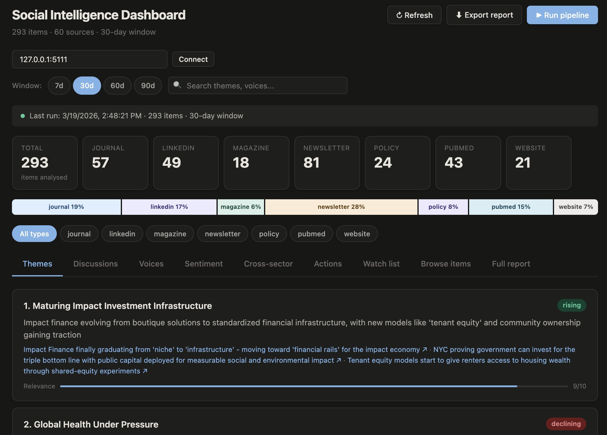

# Social Intelligence Engine

No more manually scanning LinkedIn, journals, and newsletters to figure out what's happening in your space. This script monitors 70+ sources across global health, impact investing, and social innovation, runs everything through Claude AI, and generates a monthly intelligence briefing in one run.

Output: a live dashboard on localhost + Markdown report with themes, sentiment analysis, notable voices, and actionable recommendations.

Built and tested with 215+ items from 17 sources.

---

## Preview



---

## What it monitors

- **LinkedIn (25 profiles/orgs)** — Ilona Kickbusch, Paul Polman, Jacqueline Novogratz, EPHA, GIIN, Philea, EURORDIS, and more
- **Journals (5)** — The Lancet, BMJ, BMC Public Health, Health Policy, Milbank Quarterly
- **Magazines (4)** — Stanford Social Innovation Review, Devex, GreenBiz, Alliance Magazine
- **Newsletters (6)** — ImpactAlpha, Nonprofit Quarterly, Grist, Chronicle of Philanthropy, Intl Health Policies, Heated
- **Podcasts (5)** — Outrage + Optimism, Business Fights Poverty, Impact Boom, Superpowers for Good, Giving with Impact
- **Websites (6)** — WHO Civil Society Commission, EPF, EURORDIS, NextBillion, Philanthropy Impact, EuroHealth

---

## What it produces

- **Top 5 themes** with momentum indicators (rising/stable/declining) and relevance scores
- **Key discussions** — what's being debated across the ecosystem
- **Cross-sector connections** — where health, investing, philanthropy, and climate overlap
- **Notable voices** — who's driving the conversation and what they're saying
- **Sentiment by sector** — health policy, impact investing, patient advocacy, philanthropy, climate
- **Watch list** — upcoming events, publications, decisions to track
- **Recommendations** — prioritized actions (high/medium/low)
- **Full Markdown report** — ready for leadership distribution

---

## Stack

Python · Claude AI (Sonnet) · Apify · Flask · feedparser

---

## Setup

**Install dependencies**

```
pip3 install requests feedparser python-dateutil flask flask-cors python-dotenv
```

**API keys**

Create a `.env` file (no quotes):

```
ANTHROPIC_API_KEY=sk-ant-your-key-here
APIFY_API_TOKEN=apify_api_your-token-here
```

| Service | What for | Cost |
|---------|----------|------|
| Anthropic | Claude AI analysis + report | ~$0.50/run |
| Apify | LinkedIn + website scraping | ~$5/month |

**Run**

```
python3 engine.py serve
```

Then open `dashboard.html` in your browser and click **Run pipeline**.

Or run the full pipeline directly:

```
python3 engine.py run
```

---

## Output files

- `data/latest_dashboard.json` — structured analysis for the dashboard
- `reports/report_YYYY-MM-DD.md` — full Markdown intelligence briefing
- `data/analysis_YYYY-MM-DD.json` — raw AI analysis with all themes, voices, recommendations
- `data/collected_YYYY-MM-DD_HHMM.json` — raw collected data from all sources

---

## API (for n8n or other automation)

| Endpoint | Method | What it does |
|----------|--------|-------------|
| `/api/run` | POST | Full pipeline: collect + analyze + report |
| `/api/collect` | POST | Collect data only |
| `/api/analyze` | POST | Analyze latest collected data |
| `/api/dashboard` | GET | Latest dashboard JSON |
| `/api/report` | GET | Latest Markdown report |
| `/health` | GET | Health check |

Import `n8n-trigger-workflow.json` into n8n to run on a weekly schedule.
